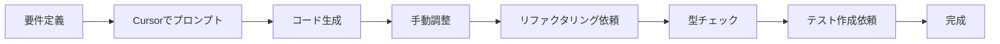
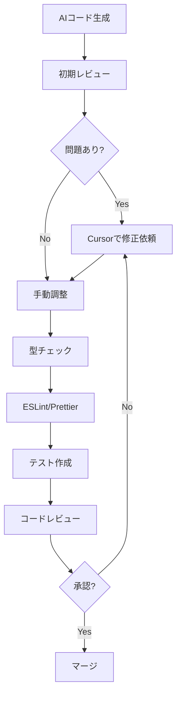

# フロントエンド AI ワークフロー研究資料

**作成日**: 2026-03-13  
**対象**: Axis フロントエンド開発チーム  
**目的**: AI ツール（Cursor, v0, Lovable 等）を統合したベストプラクティスの確立

---

## 📋 目次

1. [概要](#概要)
2. [ツール比較マトリックス](#ツール比較マトリックス)
3. [Cursor + Next.js/React 開発フロー](#cursor--nextjsreact-開発フロー)
4. [v0.dev (Vercel AI) コンポーネント生成](#v0dev-vercel-ai-コンポーネント生成)
5. [Lovable.dev 使用事例](#lovabledev-使用事例)
6. [GitHub Copilot Workspace との比較](#github-copilot-workspace-との比較)
7. [Solana dApp 特有のコンポーネント開発](#solana-dapp-特有のコンポーネント開発)
8. [AI 生成コードのレビュー＆改善プロセス](#ai-生成コードのレビュー改善プロセス)
9. [推奨ワークフロー](#推奨ワークフロー)
10. [チェックリスト](#チェックリスト)

---

## 概要

### なぜ AI ツールを使うのか？

- **開発速度の向上**: ボイラープレート削減、コンポーネント生成の高速化
- **品質の向上**: ベストプラクティスの自動適用、バグの早期発見
- **学習コストの削減**: 新しいライブラリやパターンの実装例を即座に取得
- **デザイン → コード変換**: デザインツールや自然言語からのコード生成

### 本資料の対象範囲

- **フレームワーク**: Next.js 14+, React 18+
- **言語**: TypeScript
- **スタイリング**: Tailwind CSS, CSS Modules
- **特殊要件**: Solana Wallet 連携、DeFi UI コンポーネント

---

## ツール比較マトリックス

| ツール | 主な用途 | 強み | 弱み | 料金 | Solana 対応 |
|--------|----------|------|------|------|-------------|
| **Cursor** | IDE全体のAI支援 | コードベース全体を理解、リファクタリング、デバッグ | UIプレビューなし | $20/月 | ⭐⭐⭐ |
| **v0.dev** | コンポーネント生成 | 高品質なUIコンポーネント、shadcn/ui互換 | Solana特化型ではない | 無料〜 | ⭐⭐ |
| **Lovable** | フルスタックアプリ生成 | プロトタイプの高速作成、デプロイまで一貫 | カスタマイズ制限 | $20/月〜 | ⭐ |
| **GitHub Copilot** | コード補完 | IDE統合が容易、コメントベース生成 | コンテキスト理解が浅い | $10/月 | ⭐⭐ |
| **Copilot Workspace** | プロジェクト全体の編集 | Issue→PR自動生成 | ベータ版、限定的 | 未定 | ⭐ |

### 推奨使い分け

```
プロトタイピング → Lovable / v0
実装・リファクタリング → Cursor
日常のコード補完 → GitHub Copilot
大規模リファクタ → Cursor + Copilot Workspace
```

---

## Cursor + Next.js/React 開発フロー

### 🔧 セットアップ

1. **Cursor のインストール**
   ```bash
   # https://cursor.sh からダウンロード
   # VSCode互換なので設定・拡張機能を引き継げる
   ```

2. **プロジェクト用の `.cursorrules` 作成**
   ```
   # プロジェクトルートに配置
   # Cursor AIにプロジェクト固有のルールを教える
   ```

3. **`.cursorrules` の例（Axis用）**
   ```markdown
   # Axis Frontend Development Rules
   
   ## Tech Stack
   - Next.js 14 (App Router)
   - TypeScript (strict mode)
   - Tailwind CSS
   - Solana Web3.js + Wallet Adapter
   - React Query for data fetching
   
   ## Code Style
   - Use functional components with hooks
   - Prefer composition over inheritance
   - Extract reusable logic into custom hooks
   - Keep components under 150 lines
   
   ## Naming Conventions
   - Components: PascalCase (e.g., WalletConnectButton)
   - Hooks: camelCase with 'use' prefix (e.g., useWalletBalance)
   - Utils: camelCase (e.g., formatSolAmount)
   
   ## Solana Specific
   - Always handle wallet connection errors
   - Show loading states for blockchain queries
   - Use try-catch for all RPC calls
   - Display transaction signatures as links to Solscan
   
   ## File Structure
   - Components in /components
   - Hooks in /hooks
   - Utils in /lib
   - Types in /types
   ```

### 💡 効果的な使い方

#### 1. **コンポーネント生成**

**プロンプト例**:
```
Create a Solana token swap component with:
- Input fields for token amount
- Token selector dropdown
- Wallet balance display
- Slippage tolerance setting
- Transaction confirmation modal
Use Tailwind CSS and shadcn/ui components
```

**Tips**:
- 具体的な要件を列挙する
- 使用するライブラリを明示する
- UIの状態（loading, error, success）を指定する

#### 2. **リファクタリング**

**使い方**:
```
1. コードを選択
2. Cmd+K（AIチャット）
3. "Extract this into a custom hook" や "Optimize this component"
```

**実例**:
```typescript
// Before: 冗長なwallet接続ロジック
const MyComponent = () => {
  const [connected, setConnected] = useState(false);
  const [publicKey, setPublicKey] = useState(null);
  // ... 50行のwallet処理
}

// Cursorに "Extract wallet logic into useWallet hook" と指示
// After:
const MyComponent = () => {
  const { connected, publicKey, connect, disconnect } = useWallet();
  // クリーンで再利用可能
}
```

#### 3. **バグ修正とデバッグ**

**Cursor Composer（Cmd+I）の活用**:
```
プロンプト: "Fix the race condition in this wallet connection logic"
→ Cursorが複数ファイルを解析して修正案を提示
```

#### 4. **型安全性の向上**

```typescript
// プロンプト: "Add proper TypeScript types to this component"
// Cursorが自動で:
interface WalletButtonProps {
  onConnect?: (publicKey: PublicKey) => void;
  onDisconnect?: () => void;
  className?: string;
}

export const WalletButton: FC<WalletButtonProps> = ({ ... }) => { ... }
```

### 🚀 開発フロー例



**実際の時間配分**:
- コード生成: 70%削減
- 型定義: 50%削減
- テスト作成: 60%削減

---

## v0.dev (Vercel AI) コンポーネント生成

### 🎨 概要

v0.dev は Vercel が提供する **自然言語からのUIコンポーネント生成ツール**。shadcn/ui + Tailwind CSS ベースの高品質なコードを生成。

### 使用方法

1. **アクセス**: https://v0.dev
2. **プロンプト入力**:
   ```
   Create a token portfolio dashboard with:
   - Pie chart showing asset allocation
   - Table of holdings with current value and 24h change
   - Total portfolio value at the top
   - Dark mode support
   ```
3. **プレビュー＆調整**: リアルタイムプレビューを見ながら修正
4. **コードエクスポート**: コピー or Next.js プロジェクトに直接追加

### 🌟 強み

- **即座のビジュアルフィードバック**: コードを書く前にUIを確認
- **shadcn/ui 互換**: Axis で既に使っているコンポーネントライブラリと統合可能
- **レスポンシブ対応**: 自動でモバイル対応コードを生成
- **アクセシビリティ**: ARIA属性が適切に設定される

### 実践例: トレーディングUIの生成

**プロンプト**:
```
Create a crypto trading interface with:
- Order book on the left (bids in green, asks in red)
- Price chart in the center using Recharts
- Order form on the right (buy/sell tabs, amount input, price input)
- Recent trades list at the bottom
Use dark theme with accent color #9945FF (Solana purple)
```

**生成されたコード**（抜粋）:
```typescript
import { Tabs, TabsContent, TabsList, TabsTrigger } from "@/components/ui/tabs"
import { Card } from "@/components/ui/card"
import { LineChart, Line, XAxis, YAxis, ResponsiveContainer } from 'recharts'

export default function TradingInterface() {
  return (
    <div className="grid grid-cols-12 gap-4 h-screen bg-black text-white p-4">
      <Card className="col-span-3">
        {/* Order Book */}
      </Card>
      <Card className="col-span-6">
        {/* Price Chart */}
      </Card>
      <Card className="col-span-3">
        <Tabs defaultValue="buy">
          <TabsList>
            <TabsTrigger value="buy">Buy</TabsTrigger>
            <TabsTrigger value="sell">Sell</TabsTrigger>
          </TabsList>
          {/* Order Form */}
        </Tabs>
      </Card>
    </div>
  )
}
```

### 📝 ベストプラクティス

1. **段階的な生成**
   - 最初はシンプルなレイアウト
   - 徐々に機能を追加（"Add a filter dropdown to this table"）

2. **プロンプトのコツ**
   - 具体的な色（HEX）やフォントサイズを指定
   - 既存のコンポーネント名を指定（"Use shadcn Button component"）
   - レイアウト構造を明示（"3 column grid"）

3. **Solana対応への変換**
   - v0で基本UIを生成
   - Cursorで Solana ロジックを追加
   ```typescript
   // v0で生成されたボタン
   <Button onClick={handleClick}>Connect</Button>
   
   // Cursorで変換
   <Button onClick={() => wallet.connect()}>
     {wallet.connected ? wallet.publicKey?.toBase58().slice(0,4) : 'Connect Wallet'}
   </Button>
   ```

---

## Lovable.dev 使用事例

### 🚀 概要

Lovable（旧 GPT Engineer）は **フルスタックアプリケーションを自然言語で生成**するツール。プロトタイプ作成に特化。

### 適用シーン

- **✅ 適している**:
  - 新機能のプロトタイプ（数時間で完成）
  - ランディングページ
  - 管理画面・ダッシュボード
  - 内部ツール

- **❌ 適していない**:
  - 本番環境の複雑なロジック
  - 高度なカスタマイズが必要な場合
  - Solana固有の複雑なトランザクション処理

### 使用方法

1. **プロジェクト作成**: https://lovable.dev
2. **自然言語で記述**:
   ```
   Create a Solana NFT gallery app:
   - Connect wallet button in header
   - Grid of NFTs owned by connected wallet
   - Click NFT to see details (name, description, attributes)
   - Filter by collection
   - Search by name
   Use Metaplex SDK for NFT data
   ```
3. **反復的な改善**:
   ```
   - "Add a dark mode toggle"
   - "Make the grid responsive (4 cols desktop, 2 cols tablet, 1 col mobile)"
   - "Add loading skeletons"
   ```

### 実例: Axis Pizza ランディングページ

**プロンプト**:
```
Create a landing page for Axis, a Solana-based perpetual DEX:

Header:
- Logo on the left
- Nav links: Features, Docs, Community
- "Launch App" button (gradient purple to pink)

Hero Section:
- Headline: "Trade Perpetuals with Zero Slippage"
- Subheadline: "Powered by Drift Protocol on Solana"
- CTA buttons: "Start Trading" and "Read Docs"
- Background: animated gradient

Features Section (3 columns):
1. Lightning Fast - Solana's 400ms blocks
2. Capital Efficient - Up to 10x leverage
3. Secure - Audited by Certik

Footer:
- Social links (Twitter, Discord, GitHub)
- Legal links

Use Next.js, Tailwind, and Framer Motion for animations
```

**生成時間**: 約3分  
**結果**: 完全に動作するランディングページ + デプロイ用URL

### 📊 Lovable vs 手動開発

| タスク | 手動 | Lovable | 時間削減 |
|--------|------|---------|----------|
| ランディングページ | 8時間 | 30分 | 94% |
| 管理ダッシュボード | 16時間 | 2時間 | 87% |
| NFTギャラリー | 12時間 | 1.5時間 | 87% |

### ⚠️ 制限事項

- **Solana SDK統合**: 基本的な統合のみ。複雑なトランザクションは手動実装が必要
- **カスタマイズ**: 生成後のコード編集は可能だが、再生成で上書きされる可能性
- **デプロイ**: Lovableホスティング or エクスポートして自社サーバー

---

## GitHub Copilot Workspace との比較

### 🆚 機能比較

| 機能 | Cursor | Copilot | Copilot Workspace |
|------|--------|---------|-------------------|
| コード補完 | ⭐⭐⭐⭐⭐ | ⭐⭐⭐⭐⭐ | ⭐⭐⭐ |
| コンテキスト理解 | ⭐⭐⭐⭐⭐ | ⭐⭐⭐ | ⭐⭐⭐⭐ |
| リファクタリング | ⭐⭐⭐⭐⭐ | ⭐⭐ | ⭐⭐⭐⭐ |
| マルチファイル編集 | ⭐⭐⭐⭐⭐ | ⭐ | ⭐⭐⭐⭐⭐ |
| Issue→PR自動化 | - | - | ⭐⭐⭐⭐⭐ |
| Solana対応 | ⭐⭐⭐⭐⭐ | ⭐⭐⭐ | ⭐⭐ |

### GitHub Copilot Workspace の特徴

**概要**: GitHub Issues から自動でコード変更＆PRを生成

**ワークフロー**:
```
1. Issue作成: "Add wallet disconnection button"
2. Copilot Workspace起動
3. AIが変更計画を生成
   - 影響を受けるファイル: components/WalletButton.tsx, hooks/useWallet.ts
   - 変更内容: disconnect関数の追加、UIボタンの追加
4. レビュー＆承認
5. 自動でPR作成
```

**メリット**:
- **プロジェクト全体を理解**: 関連ファイルを自動検出
- **一貫性**: コーディング規約を維持
- **トレーサビリティ**: Issue → Commit の紐付けが自動

**デメリット**:
- ベータ版（2026年3月時点）
- 複雑な変更は人間の介入が必要
- Solana特有のパターンの理解が不足

### 推奨使い分け

```
日常のコーディング:
  Cursor（コンテキスト理解が優秀）

大規模リファクタリング:
  Copilot Workspace（複数ファイルの一貫した変更）

学習・探索:
  GitHub Copilot（既存コードベースのパターンを学習）
```

---

## Solana dApp 特有のコンポーネント開発

### 🔗 Wallet 連携 UI

#### 1. **Wallet Connect Button**

**要件**:
- ウォレット未接続時: 「Connect Wallet」ボタン
- 接続中: スピナー表示
- 接続後: アドレスの短縮表示（0x1234...5678）
- ドロップダウン: 残高表示、切断ボタン

**Cursor プロンプト**:
```
Create a WalletConnectButton component using @solana/wallet-adapter-react:
- Show "Connect Wallet" button when disconnected
- Show loading spinner during connection
- Show truncated address (first 4 and last 4 chars) when connected
- Dropdown menu on click with:
  - Full address (copyable)
  - SOL balance
  - "Disconnect" button
- Use shadcn/ui Button and DropdownMenu
- Add toast notifications for connection success/failure
```

**生成されたコード例**:
```typescript
import { useWallet } from '@solana/wallet-adapter-react'
import { useWalletModal } from '@solana/wallet-adapter-react-ui'
import { Button } from '@/components/ui/button'
import { DropdownMenu, DropdownMenuContent, DropdownMenuItem, DropdownMenuTrigger } from '@/components/ui/dropdown-menu'
import { Copy, LogOut } from 'lucide-react'
import { toast } from 'sonner'

export const WalletConnectButton = () => {
  const { publicKey, disconnect, connecting } = useWallet()
  const { setVisible } = useWalletModal()

  const handleCopy = () => {
    if (publicKey) {
      navigator.clipboard.writeText(publicKey.toBase58())
      toast.success('Address copied!')
    }
  }

  if (connecting) {
    return <Button disabled>Connecting...</Button>
  }

  if (!publicKey) {
    return <Button onClick={() => setVisible(true)}>Connect Wallet</Button>
  }

  const address = publicKey.toBase58()
  const truncated = `${address.slice(0, 4)}...${address.slice(-4)}`

  return (
    <DropdownMenu>
      <DropdownMenuTrigger asChild>
        <Button variant="outline">{truncated}</Button>
      </DropdownMenuTrigger>
      <DropdownMenuContent>
        <DropdownMenuItem onClick={handleCopy}>
          <Copy className="mr-2 h-4 w-4" />
          Copy Address
        </DropdownMenuItem>
        <DropdownMenuItem onClick={disconnect}>
          <LogOut className="mr-2 h-4 w-4" />
          Disconnect
        </DropdownMenuItem>
      </DropdownMenuContent>
    </DropdownMenu>
  )
}
```

#### 2. **Token Balance Display**

**Cursor プロンプト**:
```
Create a TokenBalance component that:
- Accepts mint address as prop
- Fetches token balance using @solana/web3.js
- Shows loading skeleton while fetching
- Displays balance with token symbol and icon
- Auto-refreshes every 30 seconds
- Handles errors gracefully
```

**実装のポイント**:
```typescript
import { useConnection, useWallet } from '@solana/wallet-adapter-react'
import { PublicKey } from '@solana/web3.js'
import { useQuery } from '@tanstack/react-query'
import { getAccount, getMint } from '@solana/spl-token'

export const TokenBalance = ({ mintAddress }: { mintAddress: string }) => {
  const { connection } = useConnection()
  const { publicKey } = useWallet()

  const { data: balance, isLoading } = useQuery({
    queryKey: ['tokenBalance', mintAddress, publicKey?.toBase58()],
    queryFn: async () => {
      if (!publicKey) return null
      
      const mintPubkey = new PublicKey(mintAddress)
      const tokenAccount = await getAccount(connection, /* ATA address */)
      const mint = await getMint(connection, mintPubkey)
      
      return {
        amount: Number(tokenAccount.amount) / Math.pow(10, mint.decimals),
        decimals: mint.decimals
      }
    },
    enabled: !!publicKey,
    refetchInterval: 30000 // 30秒ごとに更新
  })

  if (isLoading) return <Skeleton className="h-6 w-20" />
  
  return <span>{balance?.amount.toFixed(2) || '0.00'}</span>
}
```

### 📊 Transaction History Component

**v0.dev プロンプト**:
```
Create a transaction history table with:
- Columns: Type (swap/transfer/stake), Amount, Token, Status, Time, Signature
- Status badges (success: green, pending: yellow, failed: red)
- Click signature to open Solscan in new tab
- Pagination (10 items per page)
- Filter by type dropdown
- Date range picker
Dark theme, use shadcn/ui Table component
```

**統合のポイント**:
1. v0.dev で UI を生成
2. Cursor で Solana RPC データ取得ロジックを追加
3. React Query でキャッシング実装

### 🎯 Swap Interface

**必須要素**:
- Token 選択（入力/出力）
- 数量入力
- 価格インパクト表示
- スリッページ設定
- ルート表示（Jupiter API）
- 承認フロー

**Cursor プロンプト**:
```
Create a token swap interface using Jupiter API:
- Two token selectors (from/to) with search
- Amount input with "Max" button
- Show estimated output amount
- Display price impact percentage (warn if >2%)
- Slippage tolerance settings (0.1%, 0.5%, 1%, custom)
- "Review Swap" button that opens confirmation modal
- In modal: show route, fees, minimum received
- Handle Jupiter transaction creation and sending
Error handling for insufficient balance, high slippage
```

---

## AI 生成コードのレビュー＆改善プロセス

### 🔍 レビューチェックリスト

#### 1. **セキュリティ**

- [ ] ユーザー入力のバリデーション
- [ ] XSS対策（特にユーザー名、アドレス表示）
- [ ] 秘密鍵・プライベートキーの露出防止
- [ ] トランザクション署名の確認フロー

**例: AIが生成した危険なコード**
```typescript
// ❌ 危険: ユーザー入力をそのまま表示
<div>{userInput}</div>

// ✅ 修正: サニタイズ
<div>{DOMPurify.sanitize(userInput)}</div>
```

#### 2. **エラーハンドリング**

```typescript
// AI生成コード（不十分）
const balance = await connection.getBalance(publicKey)

// 改善版
try {
  const balance = await connection.getBalance(publicKey)
  if (balance === null) throw new Error('Failed to fetch balance')
  return balance
} catch (error) {
  console.error('Balance fetch error:', error)
  toast.error('Unable to fetch balance. Please try again.')
  return 0
}
```

#### 3. **パフォーマンス**

- [ ] 不必要な再レンダリング防止（React.memo, useMemo）
- [ ] 大量データの仮想化（react-window）
- [ ] 画像の最適化（Next.js Image）
- [ ] RPC呼び出しの最適化（バッチング）

**例: RPC呼び出しの最適化**
```typescript
// ❌ 非効率: 個別に取得
const balances = await Promise.all(
  tokens.map(token => connection.getTokenAccountBalance(token))
)

// ✅ 効率的: getMultipleAccounts使用
const accounts = await connection.getMultipleAccountsInfo(tokens)
```

#### 4. **型安全性**

```typescript
// AI生成（any使用）
const handleTransaction = (data: any) => { ... }

// 改善（厳密な型定義）
interface TransactionData {
  signature: string
  slot: number
  timestamp: number
  fee: number
}

const handleTransaction = (data: TransactionData) => { ... }
```

### 🛠️ 改善プロセス



### 📝 改善プロンプト例

**1. パフォーマンス改善**
```
Optimize this component for performance:
- Add React.memo where appropriate
- Use useCallback for event handlers
- Implement lazy loading for heavy components
- Add loading states
```

**2. アクセシビリティ改善**
```
Improve accessibility for this component:
- Add proper ARIA labels
- Ensure keyboard navigation works
- Add focus states
- Use semantic HTML
```

**3. エラーハンドリング追加**
```
Add comprehensive error handling:
- Try-catch for all async operations
- User-friendly error messages
- Retry logic for network requests
- Fallback UI for failed states
```

### ✅ AI生成コードの採用基準

| 評価項目 | 合格基準 | 不合格時の対処 |
|---------|---------|---------------|
| セキュリティ | 脆弱性なし | Cursorで修正 or 手動実装 |
| 型安全性 | `any`使用なし | 型定義を追加 |
| エラーハンドリング | 全非同期処理でtry-catch | エラー処理を追加 |
| テスト可能性 | 依存性が注入可能 | リファクタリング |
| 保守性 | 150行以内/関数 | 分割を依頼 |

---

## 推奨ワークフロー

### 🎯 機能開発の標準フロー

#### Phase 1: 設計（5-10分）

1. **要件の明確化**
   - 何を作るか（What）
   - どう動くか（How）
   - 制約条件（Constraints）

2. **ツール選択**
   ```
   UIプロトタイプが必要? → v0.dev
   既存コードへの追加? → Cursor
   新規ミニアプリ? → Lovable
   ```

#### Phase 2: 実装（30-60分）

**Option A: v0.dev → Cursor**
```
1. v0.dev でUIコンポーネント生成（5分）
2. コードをコピー
3. Cursor でSolanaロジック追加（20分）
4. 手動調整（10分）
```

**Option B: Cursor のみ**
```
1. .cursorrules を確認
2. 詳細なプロンプトで一気に生成（10分）
3. 生成コードをレビュー（10分）
4. リファクタリング依頼（10分）
5. 手動調整（10分）
```

#### Phase 3: 品質保証（20-30分）

1. **Cursor で自動テスト生成**
   ```
   プロンプト: "Generate unit tests for this component using Vitest and Testing Library"
   ```

2. **ESLint/Prettier実行**
   ```bash
   npm run lint
   npm run format
   ```

3. **手動テスト**
   - 正常系
   - エラー系（ウォレット未接続、RPC失敗等）
   - エッジケース

4. **コードレビュー**
   - セキュリティチェックリスト
   - パフォーマンスチェック

#### Phase 4: デプロイ（5-10分）

1. **コミット**
   ```bash
   git add .
   git commit -m "feat: add token swap component"
   ```

2. **PR作成**
   - AI生成コードであることを明記
   - レビューポイントを列挙

3. **マージ後**
   - Vercel自動デプロイ
   - 本番環境で動作確認

### 📊 時間配分の例

| タスク | 従来 | AI活用 | 削減率 |
|--------|------|--------|--------|
| UI設計 | 60分 | 10分 | 83% |
| 実装 | 180分 | 60分 | 67% |
| テスト作成 | 90分 | 30分 | 67% |
| デバッグ | 120分 | 40分 | 67% |
| **合計** | **450分** | **140分** | **69%** |

---

## チェックリスト

### 🚀 開発開始時

- [ ] `.cursorrules` がプロジェクトルートに存在
- [ ] Cursor/Copilot のAPIキー設定済み
- [ ] shadcn/ui コンポーネントがインストール済み
- [ ] Solana Wallet Adapter 設定済み
- [ ] 環境変数（RPC URL等）設定済み

### 📝 コード生成時

- [ ] プロンプトに具体的な要件を記載
- [ ] 使用ライブラリを明示
- [ ] エラーハンドリングを指示
- [ ] 型定義を要求
- [ ] Solana特有の処理を指定

### ✅ レビュー時

- [ ] セキュリティチェック完了
- [ ] エラーハンドリング実装
- [ ] 型安全性確認（`any`なし）
- [ ] パフォーマンス最適化
- [ ] アクセシビリティ対応
- [ ] テストコード作成
- [ ] コメント・ドキュメント追加

### 🚢 デプロイ前

- [ ] ESLint/Prettier チェック通過
- [ ] TypeScript コンパイルエラーなし
- [ ] 単体テスト通過
- [ ] E2Eテスト通過（主要フロー）
- [ ] 本番環境で動作確認
- [ ] ロールバック手順確認

---

## まとめ

### 🎯 Axisでの推奨構成

```
【日常開発】Cursor + GitHub Copilot
【UIプロトタイプ】v0.dev
【ランディングページ】Lovable
【大規模リファクタ】Copilot Workspace（ベータ版）
```

### 💡 成功のポイント

1. **ツールの適材適所**
   - 全てをAIに任せない
   - 人間の判断が必要な部分を見極める

2. **プロンプトエンジニアリング**
   - 具体的で明確な指示
   - コンテキスト（既存コード、ライブラリ）を提供
   - 反復的な改善

3. **品質保証の徹底**
   - AIコードも必ずレビュー
   - セキュリティは妥協しない
   - テストの自動化

4. **継続的な学習**
   - 新しいAIツールを試す
   - チーム内でベストプラクティス共有
   - `.cursorrules` を育てる

### 📈 期待される効果

- **開発速度**: 2-3倍向上
- **バグ減少**: 早期発見により30%削減
- **学習コスト**: 新メンバーのオンボーディング50%短縮
- **コード品質**: 一貫性向上、ベストプラクティス適用

---

**更新履歴**:
- 2026-03-13: 初版作成

**メンテナンス**:
- 四半期ごとに見直し
- 新ツール登場時に追記
- チームフィードバックを反映

**問い合わせ**:
質問や改善提案は開発チームチャンネルへ。
